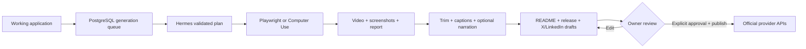

<div align="center">
  
  <h1>🎬 AI Demo Agent</h1>
  <p><strong>Turn working software into an evidence-backed product demo—without manually recording the screen.</strong></p>
  <p>Plan, operate, verify, record, package, approve, and publish a project launch through official APIs.</p>
  <p>
    
    
    
    
  </p>
</div>

> [!NOTE]
> The product was conceived and directed by Gustavo Martins and developed with
> substantial AI assistance under human review.

## The promise

AI Demo Agent does not invent features. Every claim that reaches a demo,
repository package, or social draft must be connected to visible execution
evidence or a captured repository source, and nothing is published without
explicit owner approval.

## What works today

1. A private dashboard receives a product URL, repository, and demo objective.
2. Hermes Agent creates a structured plan that is validated before execution.
3. Playwright operates web products; Hermes Computer Use handles native desktop apps.
4. The runner records video, screenshots, step evidence, and a structured report.
5. The presentation removes idle time and adds English WebVTT captions.
6. Optional OpenAI text-to-speech produces concise English narration.
7. Hermes generates a structured launch package: README, GitHub description, release notes, and separate first-person posts for X and LinkedIn.
8. The owner independently reviews and approves immutable GitHub, X, and LinkedIn snapshots.
9. Explicit publish actions use the official GitHub, X, and LinkedIn APIs with idempotent attempt records.

## From product to proof



## 🧭 Product surfaces

| Surface | Responsibility |
| --- | --- |
| Next.js dashboard | GitHub OAuth, projects, generation runs, evidence review |
| PostgreSQL | Durable state, job leases, immutable approvals, and publication attempts |
| Generation worker | Repository analysis, planning, recording, presentation, and package generation |
| Hermes Agent | Primary structured planner, desktop operator, and evidence-grounded writer behind `AiProvider` |
| Playwright | Deterministic browser interaction, screenshots, and WebM recording |
| OpenAI Audio API | Optional English narration; captions work without it |
| GitHub/X/LinkedIn APIs | Owner-triggered publication of exact approved snapshots |

The worker is intentionally separate from Next.js because planning and screen
recording can outlive an HTTP request. PostgreSQL leases prevent two workers
from processing the same run and allow recovery after a crash.

## ✂️ Presentation pipeline

Both web and desktop recordings are composed into concise presentations
rather than raw screen captures. Real per-step timing drives the edit: dead
time is trimmed, not just sped up, and an H.264 MP4 with step-synced English
captions comes out the other end. Desktop demos can additionally synthesize a
short voice-over using `gpt-4o-mini-tts` when `OPENAI_API_KEY` is configured.

Captions remain available without narration, which matters because social video
often starts muted.

## 🚀 Run locally

Requirements: Node.js 20+, Docker, Playwright Chromium, and an authenticated
`hermes` command on `PATH`.

```bash
npm install
npx playwright install chromium
cp apps/web/.env.example apps/web/.env
docker compose up -d postgres
npm run db:migrate
```

Run the dashboard and worker in separate terminals:

```bash
npm run dev:web
```

```bash
npm run worker
```

The dashboard opens at `http://localhost:3000`. GitHub OAuth admission is
restricted to `APP_OWNER_GITHUB_LOGIN`.

## 🧪 CLI workflow

Generate and inspect a plan without recording:

```bash
npm run plan -- --url https://your-product.dev --objective "Show the primary workflow"
```

Record an approved generated plan:

```bash
npm run record-plan -- output/.../demo-plan.json
```

Run a hand-authored deterministic demo:

```bash
npm run demo -- examples/example.demo.json
```

Interactive confirmation is required before browser execution unless the caller
explicitly records prior approval with `--yes`.

## ☁️ Railway deployment

The repository now includes `railway.toml` for the web process:

- `npm ci && npm run build:web` builds the application;
- `npm run db:deploy` applies migrations before startup;
- `/api/health/live` provides the liveness check;
- failed processes restart with a bounded retry policy.

The web process and generation worker must deploy from the same commit. The
worker additionally needs Hermes, Chromium, and persistent artifact storage.
See [`docs/generation-worker.md`](docs/generation-worker.md) for the operational
contract.

## 🔐 Authentication and origin safety

GitHub OAuth uses a canonical configured origin instead of trusting arbitrary
forwarded request headers. Token callbacks are normalized, production config is
validated, and diagnostics expose safe status—not secrets.

Generated media is served through an owner-authorized API route with contained
storage keys, disabled shared caching, and byte-range support. The artifact
volume must never be mounted as a public static directory.

## 🧪 Verification

```bash
npm run check
npm test
npm run lint:web
npm run build:web
npm run test:e2e
```

Focused safety checks are available through:

```bash
npm run test:social-safety
npm run test:launch-safety
npm run validate:production
```

The test suite covers planning contracts, evidence binding, recording, retries,
OAuth boundaries, media access, social approval, narration, canonical origins,
and production readiness.

## 🛡️ Current safety boundaries

- generated claims must trace back to visible evidence;
- generation retries preserve already-valid plans and artifacts;
- desktop commands are resolved without a shell and must stay inside approved roots;
- repository reads are bounded, skip secret/generated paths, and are pinned to a commit SHA;
- GitHub publishing stops if that commit or README changed after generation;
- secrets are kept server-side, omitted from errors, and never included in generated content;
- narration is optional and uses a credential separate from Hermes;
- approval and publication are separate explicit owner actions;
- identical approvals have one durable publication attempt, preventing duplicate submissions.

## 📚 Documentation

- [`docs/generation-worker.md`](docs/generation-worker.md) — queue, leases, retries, storage, and deployment;
- [`docs/github-launch-publishing.md`](docs/github-launch-publishing.md) — repository grounding, approval, GitHub permissions, and incident handling;
- [`docs/desktop-app-demos.md`](docs/desktop-app-demos.md) — native-app recording workflow;
- [`docs/`](docs/) — architecture, integrations, operations, and safety decisions.

## 🗺️ Roadmap

- connect verified mentions and platform-specific media rules;
- move persistent artifacts from a mounted volume to object storage;
- expand evals for evidence quality, claim quality, and presentation pacing.

## 📄 License

Released under the [MIT License](LICENSE).
